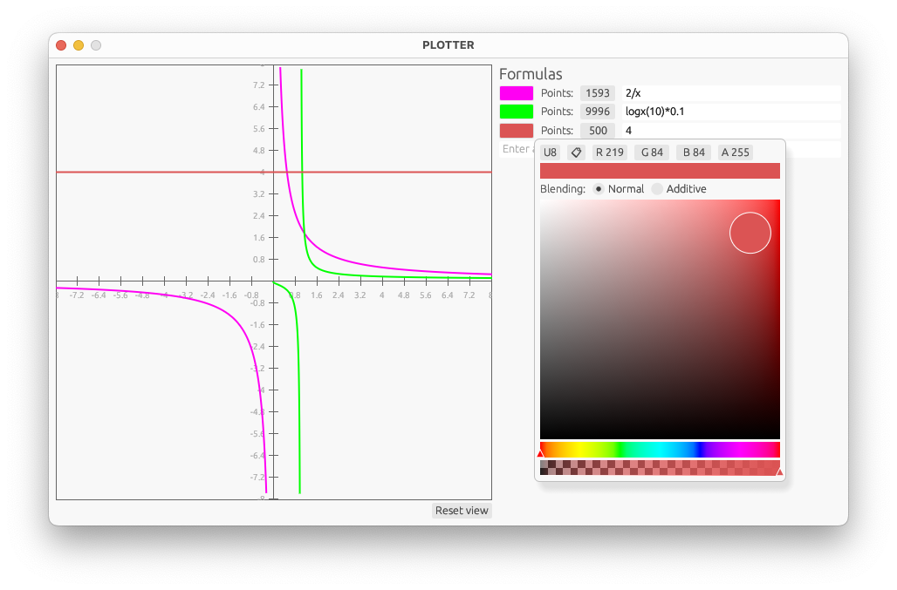

# Plotter-rs

<p align="center"></p>

A lightweight mathematical function plotter built with Rust using the [eframe/egui](https://github.com/emilk/egui) framework and custom [math-parser](https://github.com/mteit/math-parser) for expression evaluation.

## Features

- Plot multiple mathematical functions in real-time
- Customize each function with different colors and resolution
- Dynamic axis scaling with automatically adjusting labels
- Support for various mathematical expressions
- Live demo available on [GitHub Pages](https://mteit.github.io/plotter-rs/)

## Building from Source

1) Clone the repository:
```bash
git clone https://github.com/mteit/plotter-rs.git
cd plotter-rs
```

2) Build and run the native application:
```bash
cargo run --release
```

## Building WASM application

1) Clone the repository:
```bash
git clone https://github.com/mteit/plotter-rs.git
cd plotter-rs
```

2) Install required tools:
```bash
# Install wasm-pack
cargo install wasm-pack

# Add WASM target
rustup target add wasm32-unknown-unknown
```

3) Build the WASM application:
```bash
wasm-pack build --target web --out-dir pkg --release
```

4) Serve the application:

```bash
# Use a simple HTTP server
python3 -m http.server 8080
```

5) Open your browser and navigate to http://localhost:8080


###### generated by [claude.ai](claude.ai)
